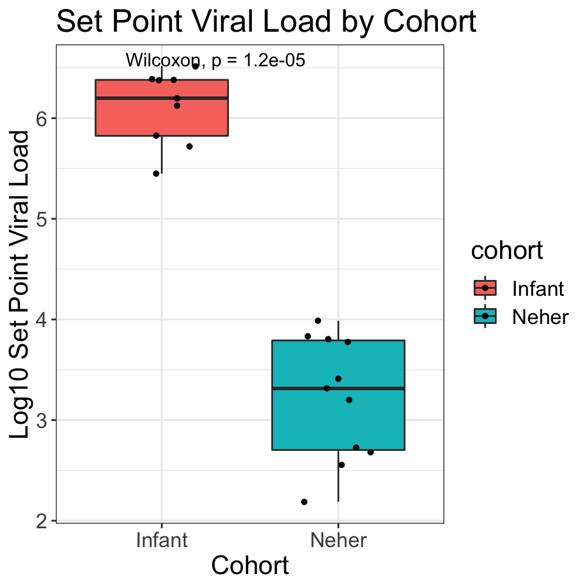
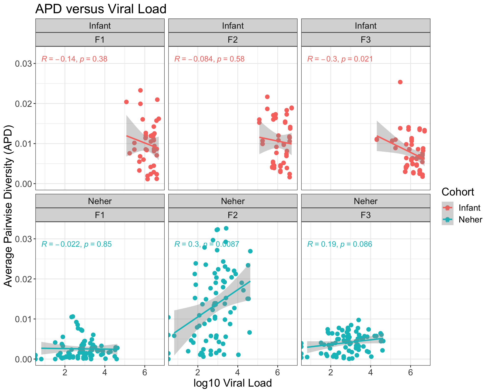
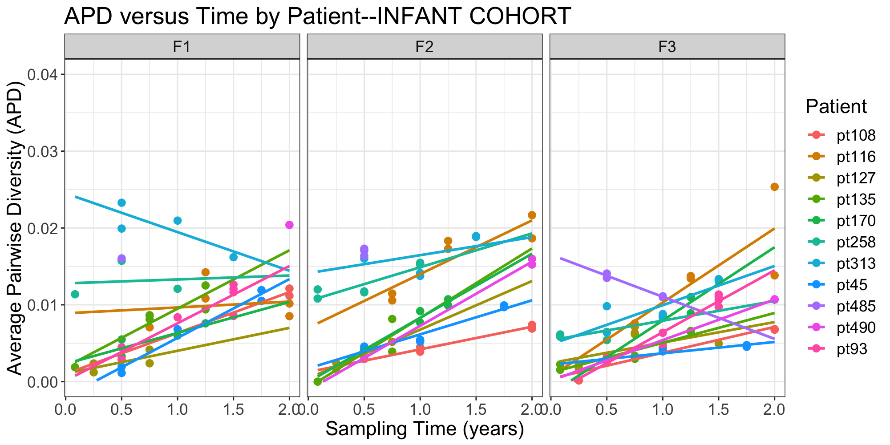
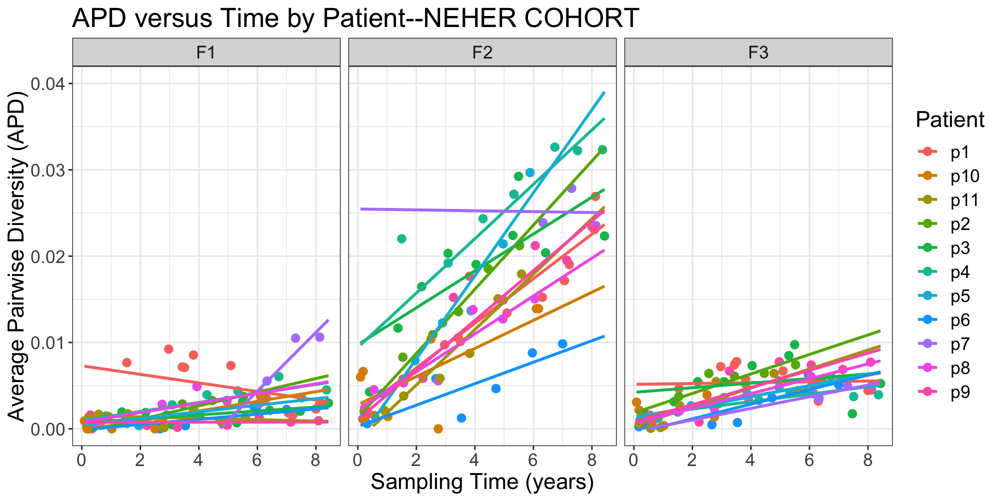
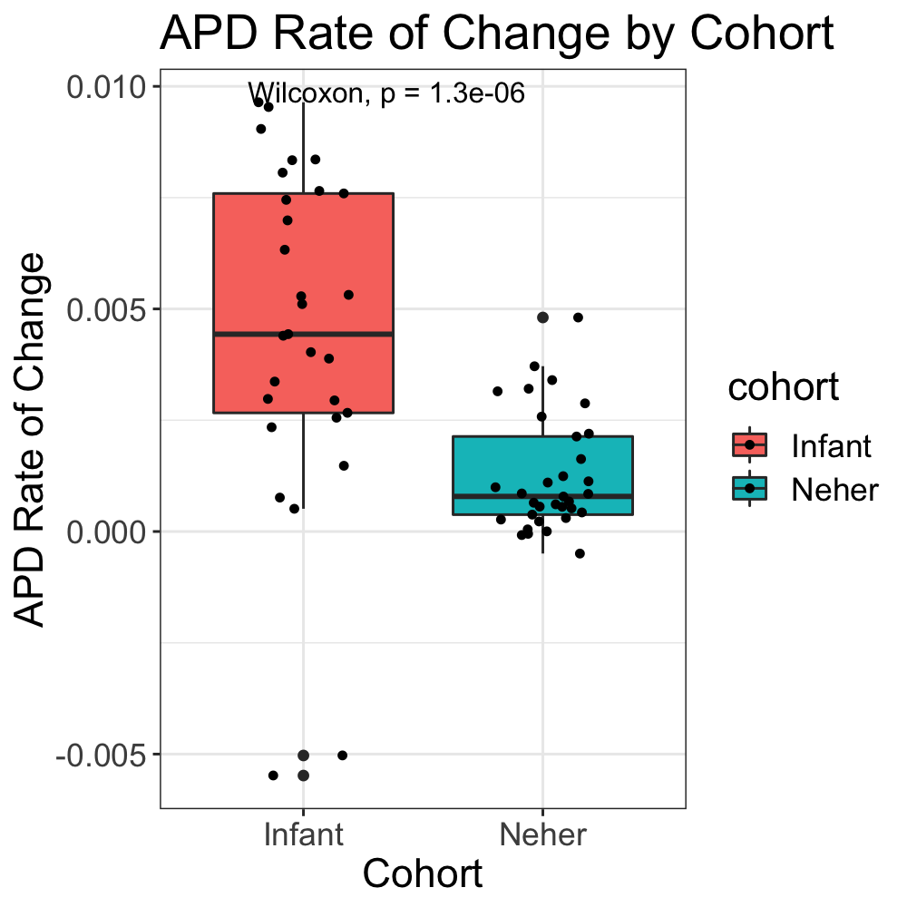
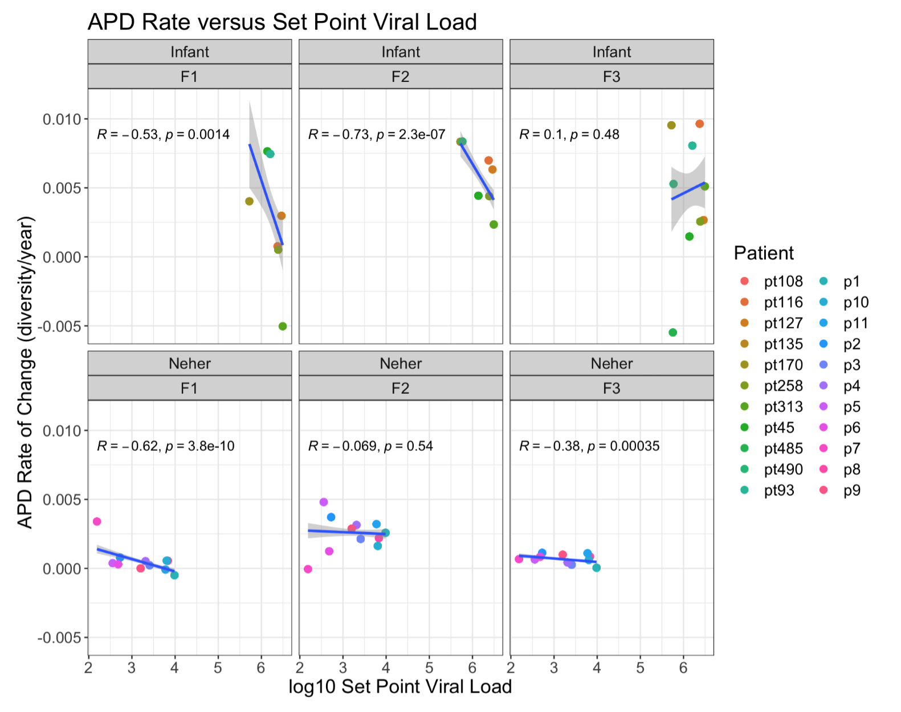

# Infection Timing Project Thoughts: Viral Load

**We discuss two different cohorts in this analysis: our infant cohort consists of 11 infants which were HIV+ at birth and the Neher cohort consists of 11 adults which became HIV+ at some point during adulthood.**
**The Neher group created a linear regression model using what we are calling the "Neher cohort" to predict time since infection given an APD value.** 
**When applying this model to our infant cohort, the model over-predicts time since infection by 1-3 years.** 
**We want to explore whether a difference in viral load could be "responsible" for this overestimation (since the model was "trained" using a purely adult cohort).**
**To do this, we have explored the following questions:**

## How does viral load compare between the two cohorts?

* If we compare the viral load of the two cohorts, the infant cohort (as expected) has a significantly higher set point viral load (average over all viral load measurements for each indiviudal) compared to the Neher cohort.

## What is the relationship between APD and viral load?

* In looking at viral load for both cohorts, overall viral load does not have a strong correlation with the APD. 
If anything, for the infant cohort, as viral load increases, APD decreases.
For the Neher cohort, as viral load increases, APD also increases for the F2 and F3 fragments, but does not have a strong correlation with APD for the other fragment.

## What is the relationship between APD and time?

* In looking at the **infant cohort**, APD of the sequence increases with time for most individuals, for all three sequence fragments.
   The figure also suggests that the rate of APD change over time (slope) may be different for each individual and for each sequence region.
   We can see this in the following figures (F1, F2, and F3 correspond to the three sequence fragments):

* We see a similar trend when looking at the **Neher training cohort** where APD of the sequence increases with time for most individuals and rate of APD change over time (slope) may be different for each individual and for each sequence region.

* If we compare the two cohorts, the infant cohort has a significantly higher rate of APD change over time compared to the Neher cohort (when pooling all sequence regions).

## We were then wondering if the higher rate of APD change over time could be related to the higher viral load in the infant cohort?

* Above we noted that rate of APD change over time (slope) may be different for each individual, for each sequence region, and for each cohort.
   For some of the sequence regions, set point viral load has a correlation with the rate of APD change over time. 
   For these sequence regions, as set point viral load increases, the rate of APD change over time seems to decrease. 

## General Conclusion:
We have decided to not include viral load into our model for predicting time since infection, given APD. 
The infant cohort has a higher viral load and a higher APD rate of change over time when compared to the Neher cohort. 
For several sequence regions, as viral load increases, APD rate of change decreases (this is observed for both cohorts). 
For other sequence regions, viral load is not strongly correlated with APD or APD rate of change.
As such, incorporating viral load into our model would not likely account for the differences in APD between the infant cohort and the Neher (adult) cohort. 
Because of this, we decided to move towards creating "infant specific" models.

