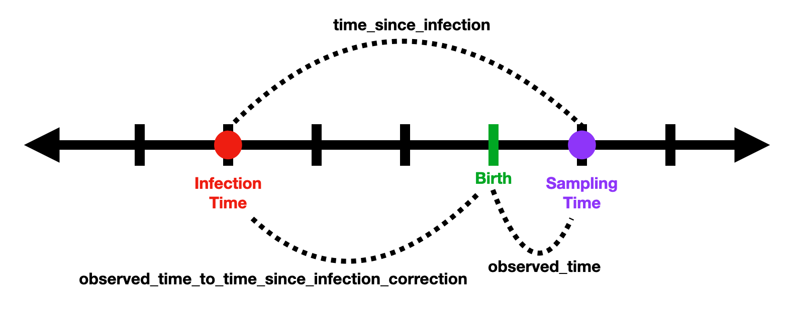

# Infection Timing Project Thoughts and Questions

## These are the assumptions we are currently making about the biology: 

1. We are striving to estimate time since infection. 
3. Individuals are infected in-utero, at birth, or through breastfeeding.
4. Individuals could have been infected at different times. 
5. "Training data" individuals were infected in-utero.
5. APD is defined to be the measure of average pairwise diversity at the third codon position using only sites at which the sum of all minor variants is greater than 0.01.
5. Infection time is defined as the time (age) at which average pairwise sequence diversity is zero.
7. Average pairwise diversity of the sequence increases with time for most individuals.
8. The rate of average pairwise diversity change over time may be different for each individual.
9. The rate of average pairwise diversity change over time may be different for each sequence fragment.
5. For the "training data", time since infection is __*not*__ the same as the observed time (age at sampling time) since individuals were infected in-utero.
5. For individuals infected in-utero, time since infection will be greater than the observed time (age at sampling time).
#  

## Here are some definitions we will use in the model explanation:

#### Key definitions:
* `apd`: APD measurements (cutoff 0.01) from all runs for each individual (not an average)
* `observation_count`:  the number of observations in the data.
* `subject_count`:  the number of individuals (or subjects) in the data.
* `fragment_count`:  the number of sequencing regions (or fragments) in the data.
* `subject`: the unique identifier of an individual or subject.
* `fragment`: to be the unique identifier of a sequencing region or fragment. 
* `observed_time`:  the age of the individual at sampling time.
* `time_since_infection`: the time since infection

#### Other definitions (to be defined in the following model explanation)
* `predicted_time_since_infection`
* `time_since_infection_variance_estimate`
* `total_slope`
* `baseline_slope`
* `subject_slope_delta`
* `subject_slope_delta_mean_estimate`
* `subject_slope_delta_variance_estimate`
* `fragment_slope_delta`
* `fragment_slope_delta_mean_estimate`
* `fragment_slope_delta_variance_estimate`
* `observed_time_to_time_since_infection_correction`
* `predicted_observed_time`
* `observed_time_variance_estimate`

#  

## Model Explanation: 

3. We model `time_since_infection` to be normally distributed around a `predicted_time_since_infection` with a `time_since_infection_variance_estimate`.
    * We choose to model `time_since_infection_variance_estimate` as a cauchy distribution with mean 0 and standard deviation, 0.5.
2. We model the function `apd` -> `predicted_time_since_infection` as a linear function with `predicted_time_since_infection` = `total_slope` * `apd`.
5. We model `total_slope` to be the sum of a `baseline_slope`, a `subject_slope_delta`, and a `fragment_slope_delta`.
3. We model the `baseline_slope` of this function as a uniform distribution, __*restricted to be positive*__.
6. We define `subject_slope_delta` to be the change in slope (or APD rate of change) from the `baseline_slope` defined uniquely for each subject. 
We model the `subject_slope_delta` of this function as a normal distribution, with mean, `subject_slope_delta_mean_estimate`, and variance, `subject_slope_delta_variance_estimate`.
    * We choose to model the `subject_slope_delta_mean_estimate` as a normal distribution with mean 0 and standard deviation, 1.
    * We choose to model the `subject_slope_delta_variance_estimate` as a cauchy distribution with mean 0 and standard deviation, 20.
7. We define `fragment_slope_delta` to be the change in slope (or APD rate of change) from the `baseline_slope` defined uniquely for each fragment.
We model the `fragment_slope_delta` of this function as a normal distribution, with mean, `fragment_slope_delta_mean_estimate`, and variance, `fragment_slope_delta_variance_estimate`.
    * We choose to model the `fragment_slope_delta_mean_estimate` as a normal distribution with mean 0 and standard deviation, 1.
    * We choose to model the `fragment_slope_delta_variance_estimate` as a cauchy distribution with mean 0 and standard deviation, 5.
5. Since the data does not directly measure `time_since_infection`, for training the model, we define an `observed_time_to_time_since_infection_correction` __*for each subject*__ which will act to convert between `time_since_infection` and `predicted_observed_time`.
    * We choose to model the `observed_time_to_time_since_infection_correction` as a uniform distribution between 0 and 0.75 (years).
6. We model `predicted_observed_time` to be the difference between `time_since_infection` and a subject specific `observed_time_to_time_since_infection_correction`.
__*See time clarification example below...*__
7. Lastly, we model `observed_time` to be normally distributed around a `predicted_observed_time` with standard deviation, 0.1.
#  
__TIME CLARIFICATION EXAMPLE:__ 
Say we have an infant that was infected three months before birth. 
Say we have a sample taken for sequencing at one month post birth. 
At one month, this individual will have an `observed_time` of 1 month. 
However, since the individual was infected four months prior to sampling, their `time_since_infection` will be 4 months at sampling time.
The difference between the `time_since_infection` and the `observed_time` will be 3 months. 
In the model, we define these three months as the `observed_time_to_time_since_infection_correction`. 

Here is an image to try and clarify: 


In equation form, this relationship is defined as follows: 
## 


*Note that this relationship is approximate due to noise in fitting the model.*
#  

## Some questions to think about: 

1. Is a linear model the best approach? 
Could we utilize another family of functions to better predict time since infection for small time, when viral load is increasing fastest? 
2. Are we sequencing viral RNA or DNA?
# 

## Model Stan Code: 

```
data{
    int<lower=1> observation_count; // number of observations
    int<lower=1> subject_count;   // number of subjects
    int<lower=1> fragment_count;  // number of fragments
    real observed_time[observation_count];   // measurement of outcome variable
    real apd[observation_count];    // predictor variable
    int subject[observation_count];   // subject index
    int fragment[observation_count];  // fragment index
}

parameters{
    real<lower=0> time_since_infection_variance_estimate;    // outcome time since infection variance (outcome uncertainty)
    real<lower=0> time_since_infection[observation_count];    // outcome
    real<lower=0, upper=150> baseline_slope;   // slope before subject/fragment slope changes
    vector[subject_count] subject_slope_delta;  // vector of subject specific slope changes
    real subject_slope_delta_mean_estimate;    // subject specific slope change mean
    real<lower=0> subject_slope_delta_variance_estimate; // subject specific slope change standard deviation
    vector[fragment_count] fragment_slope_delta;    // vector of fragment specific slope changes
    real fragment_slope_delta_mean_estimate;   // fragment specific slope change mean
    real<lower=0> fragment_slope_delta_variance_estimate;    // fragment specific slope change standard deviation
    vector<lower=0,upper=0.75>[subject_count] observed_time_to_time_since_infection_correction;    // conversion factor between observed time (age at sampling time) measurements and time since infection output
}

model{
    vector[observation_count] total_slope;
    vector[observation_count] predicted_time_since_infection;
    vector[observation_count] predicted_observed_time;

    fragment_slope_delta_mean_estimate ~ normal( 0 , 1 );
    fragment_slope_delta_variance_estimate ~ cauchy( 0 , 5 );

    subject_slope_delta_mean_estimate ~ normal( 0 , 1 );
    subject_slope_delta_variance_estimate ~ cauchy( 0 , 20 );

    fragment_slope_delta ~ normal( fragment_slope_delta_mean_estimate , fragment_slope_delta_variance_estimate );
    
    subject_slope_delta ~ normal( subject_slope_delta_mean_estimate , subject_slope_delta_variance_estimate );
    
    for ( i in 1:observation_count ) {
        total_slope[i] = (baseline_slope + subject_slope_delta[subject[i]] + fragment_slope_delta[fragment[i]]);
    }
    
    for ( i in 1:observation_count ) {
        predicted_time_since_infection[i] = total_slope[i] * apd[i]; // linear function relating apd to time_since_infection
    }
    
    time_since_infection_variance_estimate ~ cauchy( 0 , 0.5 );
    
    time_since_infection ~ normal( predicted_time_since_infection , time_since_infection_variance_estimate);
    
    for ( i in 1:observation_count ) {
        predicted_observed_time[i] = time_since_infection[i] - observed_time_to_time_since_infection_correction[subject[i]]; // Conversion between predicted_observed_time (predicted age at sampling time) and time_since_infection. Here predicted_observed_time is calculated from the difference between time_since_infection and a subject specific observed_time_to_time_since_infection_correction
    }
    
    observed_time ~ normal(predicted_observed_time, 0.1);   // the observed_time (actual measured age at sampling time) is modeled as the predicted_observed_time value with some noise
}
```