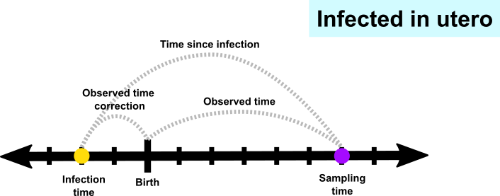
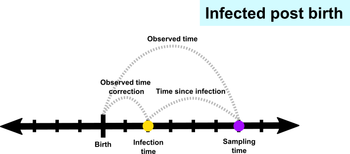
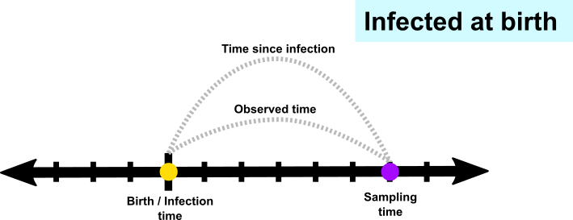

# Infection Timing (latest) Model Summary and Questions

## These are the assumptions we are currently making about the biology: 

1. We are striving to estimate time since infection. 
2. Individuals are infected in-utero, at birth, or through breastfeeding.
4. For individuals infected in-utero, time points closer to the third trimester (of pregnancy) are most likely to be the infection time.
5. Individuals infected through breastfeeding, are infected at some point after one month of age.
5. APD is defined to be the measure of average pairwise diversity at the third codon position using only sites at which the sum of all minor variants is greater than 0.01.
6. APD is zero when time since infection is zero (infection time).
7. APD of the sequence increases with time for most individuals.
8. The rate of APD change over time may be different for each individual.
9. The rate of APD change over time may be different for each sequence fragment.
10. For individuals infected in-utero, time since infection will be greater than the observed time (age at sampling time) *
11. For individuals infected at birth, time since infection will be equal to observed time *
12. For individuals infected through breastfeeding (after birth), time since infection will be less than the observed time (age at sampling time) *

`*` -- *see time clarification example in the model explanation section*.

#  

## Data processing/filtering for training and testing the model:

* We are excluding data when, for a given subject and sequence fragment, we only have one sample time point.
* For samples which have more than 2 replicates, we are including only the first 2 replicates for which we have data.
* We are averaging these two sample replicates for each subject and sequence fragment to get the final APD value used in model fitting 

## Here are some definitions we will use in the model explanation:

#### Key definitions:

* `observation_count`:  the number of observations in the data.
* `subject_count`:  the number of individuals (or subjects) in the data.
* `fragment_count`:  the number of sequencing regions (or fragments) in the data.
* `subject`: the unique identifier of an individual or subject.
* `fragment`: the unique identifier of a sequencing region or fragment. 
* `observed_time`:  the age of the individual at sampling time.
* `time_since_infection`: the time since infection
* `apd`: APD measurements (cutoff 0.01) from all runs for each individual (not an average)
* `is_utero`: TRUE/FALSE indicating whether the individual was known to be infected in utero
* `is_post`: TRUE/FALSE indicating whether the individual was known to be infected after birth

#### Other definitions (to be defined in the following model explanation)
* `predicted_time_since_infection`
* `time_since_infection_variance_estimate`
* `total_slope`
* `baseline_slope`
* `subject_slope_delta`
* `subject_slope_delta_mean_estimate`
* `subject_slope_delta_variance_estimate`
* `fragment_slope_delta`
* `fragment_slope_delta_mean_estimate`
* `fragment_slope_delta_variance_estimate`
* `observed_time_to_time_since_infection_correction`
* `predicted_observed_time`

## Model Explanation: 

1. We model `time_since_infection` to be normally distributed around a `predicted_time_since_infection` with a `time_since_infection_variance_estimate`.
    * We choose to model `time_since_infection_variance_estimate` as a cauchy distribution with mean = 0 and standard deviation = 0.5.
2. We model the function `apd` -> `predicted_time_since_infection` as a linear function with `predicted_time_since_infection` = `total_slope` * `apd`.
3. We model `total_slope` to be the sum of a `baseline_slope`, a `subject_slope_delta`, and a `fragment_slope_delta`.
4. We model the `baseline_slope` of this function as a uniform distribution, __*restricted to be positive*__.
5. We define `subject_slope_delta` to be the difference in slope (or APD rate of change) from the `baseline_slope` defined uniquely for each subject. 
We model the `subject_slope_delta` of this function as a normal distribution, with mean, `subject_slope_delta_mean_estimate`, and variance, `subject_slope_delta_variance_estimate`.
    * We choose to model the `subject_slope_delta_mean_estimate` as a normal distribution with mean = 0 and standard deviation = 1.
    * We choose to model the `subject_slope_delta_variance_estimate` as a cauchy distribution with mean = 0 and standard deviation = 20.
6. We define `fragment_slope_delta` to be the difference in slope (or APD rate of change) from the `baseline_slope` defined uniquely for each fragment.
We model the `fragment_slope_delta` of this function as a normal distribution, with mean, `fragment_slope_delta_mean_estimate`, and variance, `fragment_slope_delta_variance_estimate`.
    * We choose to model the `fragment_slope_delta_mean_estimate` as a normal distribution with mean = 0 and standard deviation =1.
    * We choose to model the `fragment_slope_delta_variance_estimate` as a cauchy distribution with mean = 0 and standard deviation = 5.
7. Since the data does not directly measure `time_since_infection`, for training the model, we define an `observed_time_to_time_since_infection_correction` __*for each subject*__ which will act to convert between `time_since_infection` and `predicted_observed_time`.
    * We choose to model the `observed_time_to_time_since_infection_correction` __*for individuals infected in utero*__ as a beta(1, 5) distribution bounded between 0 and 0.75 (years).
    * We choose to model the `observed_time_to_time_since_infection_correction` __*for individuals infected after birth*__ as a uniform distribution between -1 and -0.0833 (years).
8. We model `predicted_observed_time` to be the difference between `time_since_infection` and a __*subject specific*__ `observed_time_to_time_since_infection_correction`.
*See time clarification example below...*
9. Lastly, we model `observed_time` to be normally distributed around a `predicted_observed_time` with standard deviation = 0.1.
#  
__TIME CLARIFICATION EXAMPLE:__ 
Infants can either be infected in utero, at birth, or post birth.

Say we have an infant that was infected two months before birth. 
Say we have a sample taken for sequencing at six months post birth. 
At six months, this individual will have an `observed_time` of 6 months. 
However, since the individual was infected eight months prior to sampling, their `time_since_infection` will be 8 months at sampling time.
The difference between the `time_since_infection` and the `observed_time` will be two months. 
In the model, we define these two months as the `observed_time_to_time_since_infection_correction`--shown as "observed time correction" in the figure below. 

In equation form, this relationship for infants infected in utero is defined as follows: 
## 

Say we have an infant that was infected two months post birth. 
Say we have a sample taken for sequencing at six months post birth. 
At six months, this individual will have an `observed_time` of 6 months. 
However, since the individual was infected four months prior to sampling, their `time_since_infection` will be 4 months at sampling time.
The difference between the `time_since_infection` and the `observed_time` will be two months. 
In the model, we define these two months as the `observed_time_to_time_since_infection_correction`--shown as "observed time correction" in the figure below. 

In equation form, this relationship for infants infected post birth is defined as follows: 
## 

Say we have an infant that was infected at birth. 
Say we have a sample taken for sequencing at six months post birth. 
At six months, this individual will have an `observed_time` of 6 months. 
Since the individual was infected at birth, their `time_since_infection` will also be 6 months at sampling time.
This is shown in the figure below:

In equation form, this relationship for infants infected at birth is defined as follows: 
## 

*Note that these relationship are approximate due to noise in fitting the model.*
#  

## Some questions to think about: 

1. Is a linear model the best approach? 
Could we utilize another family of functions to better predict time since infection for small time, when viral load is increasing fastest? 
2. Are we sequencing viral RNA or DNA?
# 

The current stan model can be found [here](scripts/stan_models/multilevel_infant_model_time_error_beta.stan).
