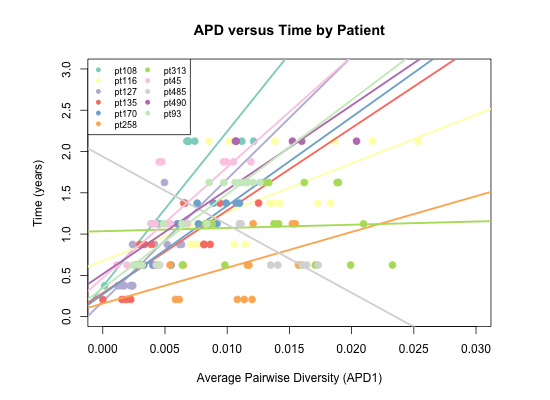

# Infection Timing Project Thoughts and Questions

## This is what we believe to be true: 

#### About the biology: 

1. We define time to be the age of the individual at sampling time.
2. Time zero is birth (NO 1.5 month shift as before).
3. Individuals are infected in-utero, at birth, or through breastfeeding.
4. Individuals could have been infected at different times. 
5. "Training data" individuals were infected in-utero.
5. Infection time is defined as the time (age) at which average pairwise sequence diversity is zero (y-intercept).
6. Estimated infection time (age) for each individual can not be greater than the first time point at which we have an average pairwise sequence diversity measure greater than zero.
7. **Average pairwise diversity of the sequence increases with time.**
8. The rate of average pairwise diversity change over time may be different for each individual.
9. The rate of average pairwise diversity change over time may be different for each sequence fragment.
10. Each "sequence replicate" (for each individual) was sequenced independently.
11. APD1 is defined to be the measure of average pairwise diversity at the third codon position using only sites at which the sum of all minor variants is greater than 0.01.

#### About the model: 

1. We are using APD1 measurements (cutoff 0.01) from all runs for each individual (not an average).
2. We model the function (average pairwise diversity) -> (time since infection) as a linear function.
3. We model the baseline slope of this function as a uniform distribution.
4. We model the variation in slope between individuals of this function as a normal distribution.
5. We model the variation in slope between sequence fragments of this function as a normal distribution.
6. We model the total slope of this function to be baseline slope (#3) + individual variable slope (#4) + fragment variable slope (#5) **with values restricted to be positive**. 
7. We model the baseline intercept of this function (i.e. time when APD is zero OR "estimated infection time") as a uniform distribution.
8. We model the variation in intercept of this function between individuals as a normal distribution.
9. We model the total intercept of this function to be the baseline intercept (#7) + individual variable intercept (#8) **with values restricted to be between 0 and -0.75 years.**

#### Some questions to think about: 

1. How do we want to limit the y-intercept (time (age) for APD = 0)? **Should we allow intercept to vary by individual?**
    * Should we restrict the y-intercept to be between 0 to -0.75 years (9 months before birth)*--as it is written now*? 
    * OR should we be more restrictive (i.e. y-intercept in the third trimester)?
    * OR should we be less restrictive (i.e. y-intercept between -0.75 to 0.75)?
    * OR something else entirely...
2. If we think that average APD increases with time, should we restrict slope values to always be positive? 
3. If we decide to restrict slope values to be positive, what do you make of the gray line in the following plot showing APD versus time by patient? 

4. It seems like one of the reasons we could be getting zero diversity is because we aren't sampling all of the diversity of an individual. 
Is there a way in which you could report a type of possibility that this was the case, per sequencing run? 
How likely do you think it is the case?

Meeting notes: 

If someone is infected with more than one virus strain, then we would expect the diversity measure to be higher at the time of infection (perhaps an explanation for the "gray line" on the APD vs. Time plot).
Restricting slope to be positive is fine. 
Question to think about: Is there a different change in rate of APD in children that were infected earlier (before birth) vs. later (after birth)?
Fix y-intercept to be zero until we get more data (i.e. individuals that are infected after birth)
?TIME! 